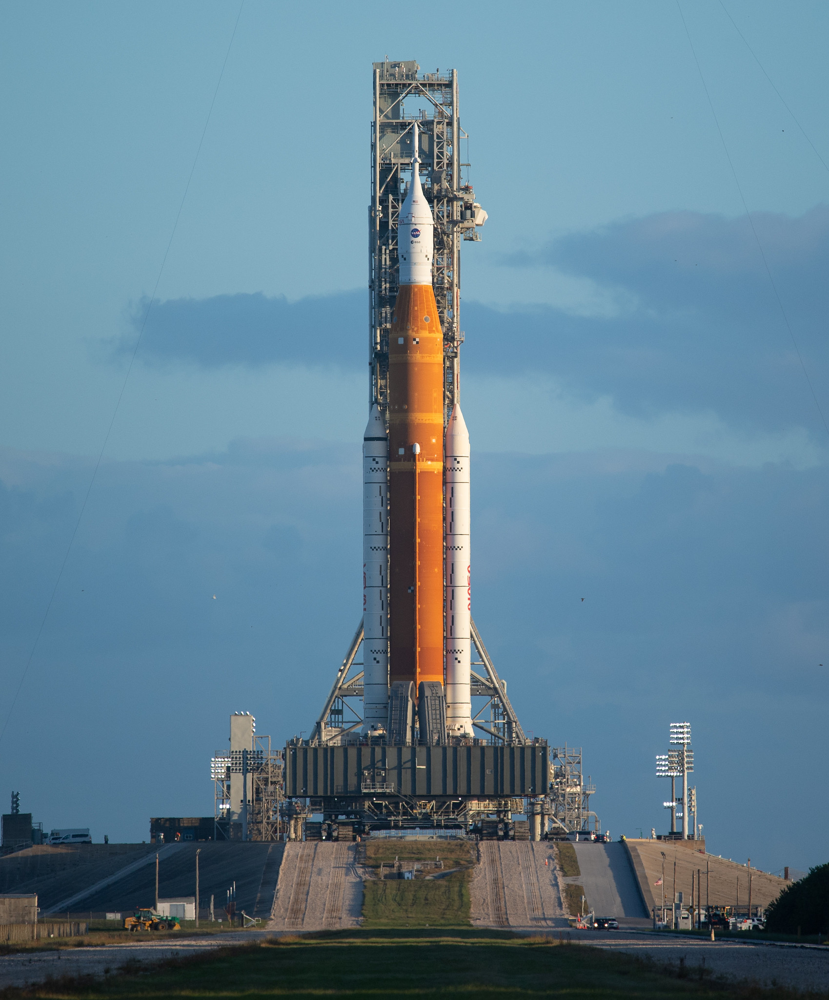
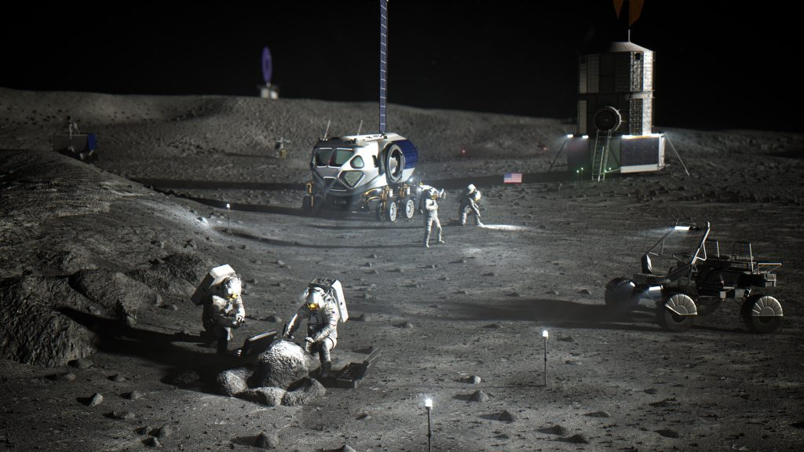
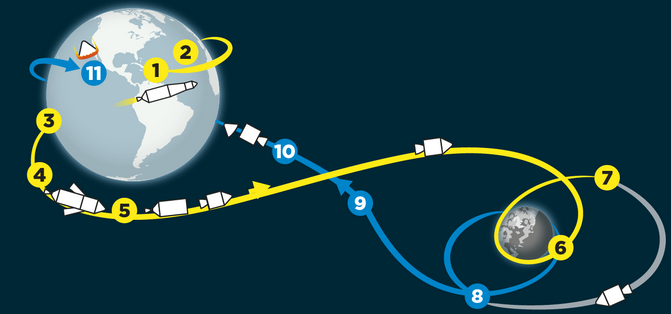

# Presentation Artemis

## Start

- A small step for a man, but a giant leap for humankind.

## 1. Recap Apollo

- Saturn V rocket
- 1969
- Neil Armstrong, Edwin Aldrin, Michael Collins
- Apollo, god of the sun and light

## 2. Artemis Mission

- SLS - Space Launch System
- Goal: Land on the moon and establish a human presence
  - Better Launch location than earth (e.g. for Mars)
  - Science
    - Ice
      - Find out how Humans evolved.
- Artemis is Apollos twin Sister, godess of the Moon and the hunt.

## 3. Artemis 1

- 2022
- uncrewed
- Test fly around the moon
- Investigate the surface
  - Water
  - Possible Base Locations
- Test rocket

## Future Plans

- Crewed flight back to the moon
  - First woman on Moon
- Build a base

## Science aspect

## Time

## Conclusion

- The artemis mission is an exciting step in our journey to estaplish presence in the solar system.
