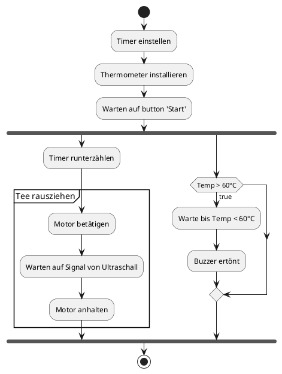

# Tee-Zieher 3000

## Team

- RaghetM - Hard- und Software, Presentation
- Egli - Hard- und Software, Presentation, Repo-Owner

## Struktur

| Phase      | Beschreibung                                                                                    |
| ---------- | ----------------------------------------------------------------------------------------------- |
| Konzept    | Konzept für Tee-Zieher 3000 erstellen => Use-Cases => benötigte Hardware                        |
| Umsetzen   | - Hardware bestellen  - Software schreiben   - Hardware aufbauen                          |
| Überprüfen | Entwickeltes Produkt Analysieren und Mängel feststellen  Gegebenenfalls zurück zu "Umsetzen" |
| Abgabe     | Abgeben und Projektpräsentation                                                                 |

## Termine und Meilensteine

1. Hardware zusammengebaut - 10h
   1. Case fertigen - 6h
   2. Sensoren / Aktoren einbauen - 4h
2. Software fertig - 15h
   1. Tee rausziehen - 2h
      1. Motor
      2. Infrarot
   2. Timer - 2h
      1. Display
      2. Input
   3. Temp - 2h
      1. Thermometer
      2. LED
      3. Buzzer
   4. buffer - 9h
   5. Addon
      1. API-Endpoint => Web / App
3. Testing - 2h
4. Abgabe
5. Präsentation - 6h

## Risiken

| Nr. | Risiko                                 | Wahrscheinlichkeit | Auswirkung                                                                                                                       | Massnahme                   |
| --- | -------------------------------------- | ------------------ | -------------------------------------------------------------------------------------------------------------------------------- | --------------------------- |
| 1   | Sensoren Funktionieren nicht           | Niedrig            | Ultraschall, Potentiometer, Knopf - Hoch (System funktioniert nicht)  Thermometer - Mittel (Funktion kann weggelassen werden) | PoC => Sensoren früh testen |
| 2   | Motor Funktioniert nicht wie gewünscht | Mittel             | Hoch (System funktioniert nicht)                                                                                                 | PoC => Motor früh testen    |
| 3   | Material nicht stabil genug            | Mittel             | Mittel (System physisch nicht stabil, trotzdem funktionsfähig)                                                                   | Struktur früh bauen         |

## Anforderungen

- Tee Ziehen
  - Motor betätigen
  - richtig stoppen (Ultraschall)
- Timer
  - User Input
  - Zum richtigen zeitpunkt ziehen
  - Display
- Thermometer
  - Messen
  - Piepen
- Stabil stehen

## Übersicht

Der Tee-Zieher 3000 unterstützt Büroarbeiter dabei, ihren Tee zum richtigen Zeitpunkt zu konsumieren. Das Gerät verhindert dabei sowohl das bitterwerden des Tees als auch das kaltwerden. Dies gelingt durch das zeitliche entfernen des Teebeutels aufgrund eines Timers, welcher durch den Benutzer konfiguriert werden kann und der Nutzung eines Thermometers, welches dem Tee beigefügt wird und zum richtigen Zeitpunkt einen Piepton ertönen lässt.

## Diagramme

